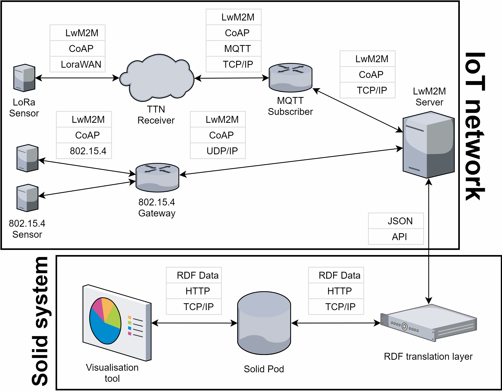

# IoT-Solid-project
Project to assemble all repo's partaining to the IoT Solid project with LwM2M for Cross-Course Project at Ghent University (2019-2020).

The complete system is visualized in the network diagram below. The different components can be found in the submodules included in this repository.



Remember, we are using submodules, so after cloning this repository, execute:
```
git submodule init
git submodule update <name-of-module>
# for each submodule, because otherwise you get credentials asked in random order (and through each other)
```


See subrepositories for details on installation, dependencies, functionality and usage.

For Leshan there is choice:
 - The leshan-server-solid is an effort to make a standalone Leshan server project using maven/git, while depending on the Leshan project.
 - However, the leshan-server-demo in Leshan has now incorporated our code, thus no difference exist in functionality, except that the demo server is upstream and will receive updates (and maybe breaking changes)
